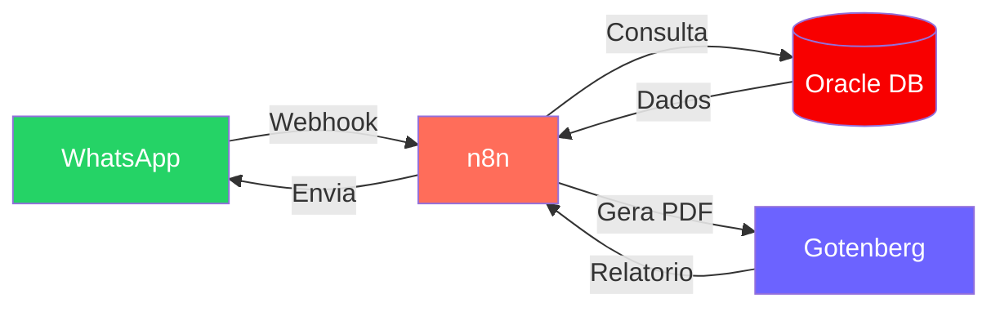

  

 

  

 

---

<h2>Sobre mim</h2>

Desenvolvedor Web com experiencia pratica em projetos completos, do front-end ao back-end, incluindo infraestrutura, containers e automacoes.

- Aplicacoes web modernas com **React**, **TypeScript** e **Next.js**
- APIs REST com **Node.js** e integracao com **Oracle Database**
- Ambientes com **Docker**, **Linux** e deploy em producao
- Automacoes com **n8n** integrando WhatsApp, APIs e bancos de dados
- Foco em **performance**, **escalabilidade** e **experiencia do usuario**

 

---

<h2>Tecnologias & Ferramentas</h2>

<table>
<tr>
<td align="center" width="110">
   
  <b>JavaScript</b>
</td>
<td align="center" width="110">
   
  <b>TypeScript</b>
</td>
<td align="center" width="110">
   
  <b>React</b>
</td>
<td align="center" width="110">
   
  <b>Next.js</b>
</td>
<td align="center" width="110">
   
  <b>Node.js</b>
</td>
</tr>
<tr>
<td align="center" width="110">
   
  <b>Python</b>
</td>
<td align="center" width="110">
   
  <b>Docker</b>
</td>
<td align="center" width="110">
   
  <b>Linux</b>
</td>
<td align="center" width="110">
   
  <b>Oracle DB</b>
</td>
<td align="center" width="110">
   
  <b>Git</b>
</td>
</tr>
</table>

---

<h2>Automacao & Integracao</h2>

<h3>Assistente Virtual WhatsApp</h3>

<blockquote>
Chatbot que atende representantes comerciais via WhatsApp, coleta dados e gera relatorios PDF automaticamente.
</blockquote>

<table>

**Stack:**

</td>
</tr>
</table>

---

<h2>Portfolio</h2>

  

---

  

